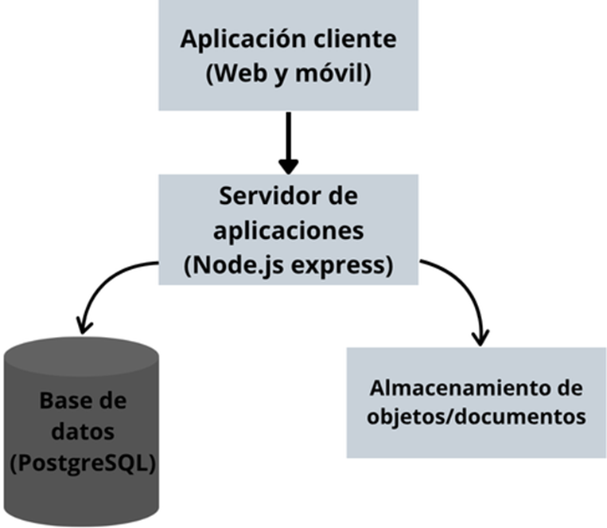

#avanceFrontend

# Definición del problema, alcance y arquitectura general

Muchas veces, los estudiantes universitarios suelen buscar mucho contenido relacionado con material de estudio, como parciales pasados, guías, y resúmenes, y todo aquello en la mayoría de los casos está repartido en correos electrónicos antiguos o grupos de mensajería, no hay un sitio para ello como tal que sea organizado y fácil de usar para los estudiantes universitarios sin que se use mucho tiempo.
El alcance se considera de un producto mínimo viable, con sus funciones esenciales para poder resolver el problema principal y satisfacer a los usuarios. Los mismos podrán registrarse, iniciar sesión y tener un perfil, al mismo tiempo, podrán subir archivos como PDFs, Words, u otro tipo de documentos y asociarlos a una materia en específico, al igual que podrán descargar los archivos subidos por otros. Los documentos se podrían organizar por “Materia” y “Semestre” y ser calificados del 1 al 5.

# OBJETIVOS
Objetivo general
Diseñar e implementar una aplicación web que sirva para la gestión de recursos académicos de los estudiantes universitarios, utilizando una arquitectura de cliente-servidor que permita el control de acceso de usuarios y la persistencia de archivos y datos.  

Objetivos específicos
•	Elaborar una interfaz de usuario web que sea responsive teniendo en cuenta HTML5, CSS3 y JavaScript para lograr las interacciones del usuario, estructurando las rutas públicas y privadas.
•	Implementar un servidor que procese la lógica de negocio, autenticación de usuarios y las peticiones asíncronas del cliente.
•	Estructurar una base de datos en MySQL que gestione las entidades del sistema, asegurando la integridad referencial y restricciones.
•	Desarrollar la lógica necesaria para el almacenamiento de documentos o apuntes en el sistema de archivos de servidor o nube.

# Esquema arquitectura aplicación

# Diagrama ER

# Apunte - Interfaz de Usuario (Frontend)

Este módulo corresponde al cliente web de la plataforma **Apunte**, diseñado con un enfoque moderno y responsive para facilitar la gestión y consulta de recursos académicos universitarios.

# Tecnologías y Herramientas
- **HTML5:** Estructura semántica de las vistas públicas y privadas.
- **CSS3:** Estilos personalizados utilizando Flexbox y CSS Grid para la adaptabilidad visual.
- **JavaScript (Vanilla):** Lógica del cliente, manejo de eventos en formularios, 
actualmente el main.js implementa validaciones en tiempo real y flujos de envío simulados
(para los formularios de inicio de sesión y registro), teniendo un feedback visual  al usuario.

## Estructura de Archivos
frontend/
├── index.html       # Landing Page principal
├── login.html       # Vista de inicio de sesión
├── registro.html    # Vista de registro de nuevos usuarios
├── styles.css (en carpeta css)       # Hoja de estilos global y diseño responsive
└── main.js (en carpeta js)           # Controladores de eventos